# eCommerce Platform Project - MERN Stack

Welcome to the eCommerce Platform Project built using the MERN (MongoDB, Express.js, React, Node.js) Stack. This project provides a robust and full-featured online shopping platform with various functionalities to enhance the user experience.

**Live App Demo** : [https://mern-frontend-s7pq.onrender.com/](https://mern-frontend-s7pq.onrender.com/)</br>

> [!NOTE]: Please be aware that Render's free tier will automatically shut down after 15 minutes of inactivity. Consequently, the first request after reactivation may experience a delay, but subsequent requests will be faster.

## Features

- **Full-Featured Shopping Cart**: Seamless shopping cart functionality for users to add, remove, and manage products.
- **Product Reviews and Ratings**: Users can leave reviews and provide ratings for products.
- **Top Products Carousel**: Display a carousel of top-rated or featured products.
- **Product Pagination**: Navigate through products efficiently with pagination.
- **Product Search Feature**: Easily search for products based on keywords.
- **User Profile with Orders**: Users can create profiles and track their order history.
- **Admin Dashboard**: Comprehensive dashboard for administrators to manage admins, products, users, and orders.
- **Admin Admin Management**: Manage admin accounts.
- **Admin Product Management**: Add, edit, and delete products from the platform.
- **Admin User Management**: Manage user accounts.
- **Admin Order Details Page**: Access detailed information about each order.
- **Mark Orders as Delivered Option**: Ability to update order status to "delivered."
- **Checkout Process**: Seamless checkout with options for shipping and payment methods.
- **Stripe Integration**: Secure payment processing through Stripe.
- **Database Seeder**: Easily populate the database with sample products and users.
## Getting Started

### Prerequisites

1. Fork the repository to your GitHub account.
2. Clone the forked repository to your local machine

```bash
git clone https://github.com/abhishekpaw/MERN.git
```

```bash
cd shopping-site-frontend
cd shopping-site-backend
```
```bash
npm install
```
<p>you can go back to the server folder and run the backend</p>

```bash
node app.ts
```

<p>While your backend is running you need to open another terminal(don't stop the backend). In the second terminal, you need to make sure you are in your root project folder and write the following:</p>

```bash
npm run dev
```

3. Create a MongoDB database and obtain your MongoDB URI from [MongoDB Atlas](https://www.mongodb.com/cloud/atlas).
4. Create a Stripe account and obtain your Key ID and Key Secret from [Stripe](https://Stripe.com/).

<h2>Project screenshots</h2>

<h3>Home page</h3>

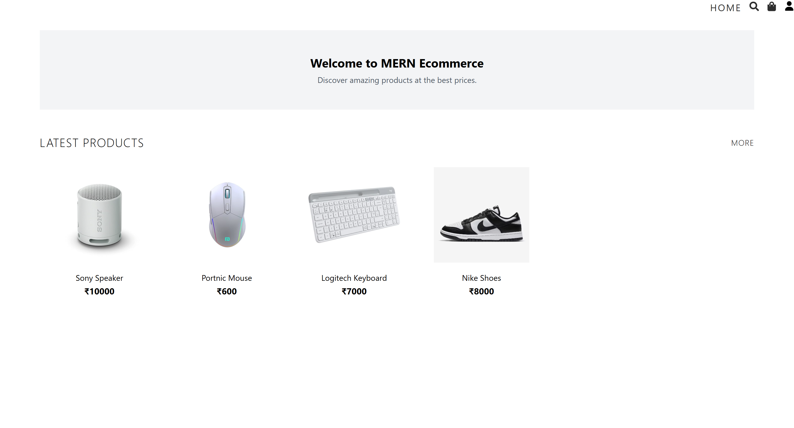

<h3>Search page</h3>

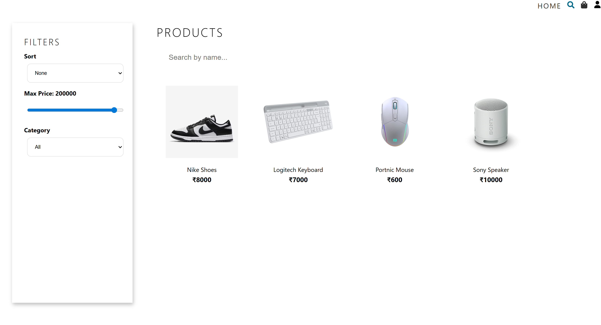

<h3>My Orders page</h3>

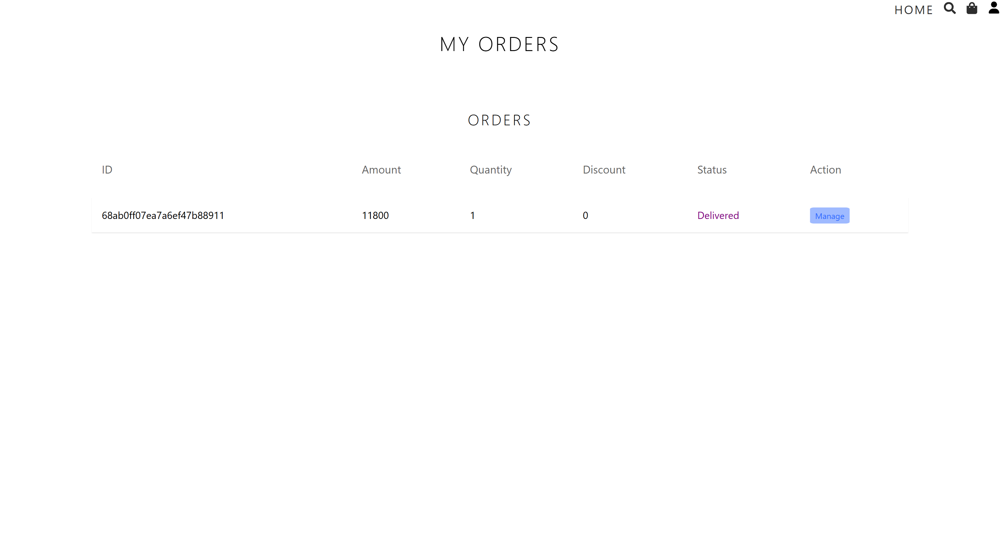

<h3>Single product page</h3>

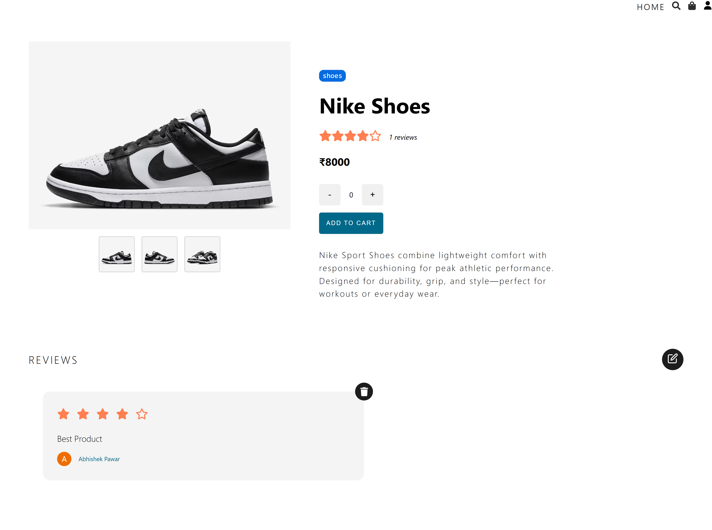

<h3>Login and Register page</h3>

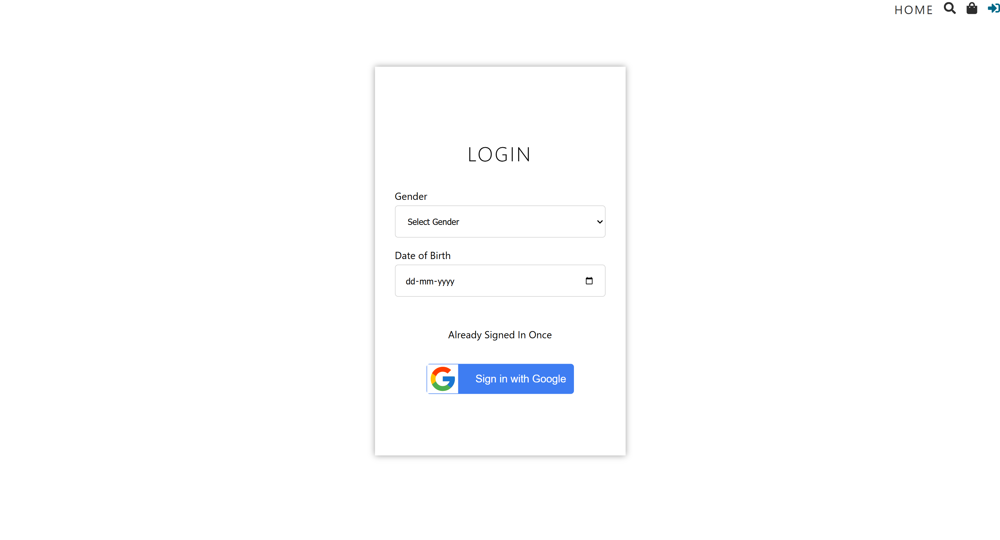

<h3>Cart page</h3>

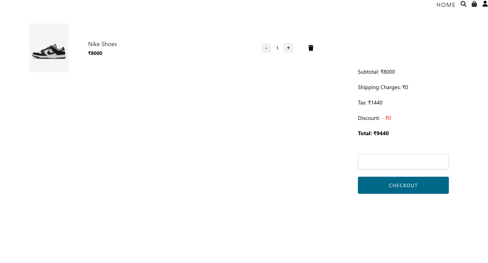

<h3>Shipping Address page</h3>

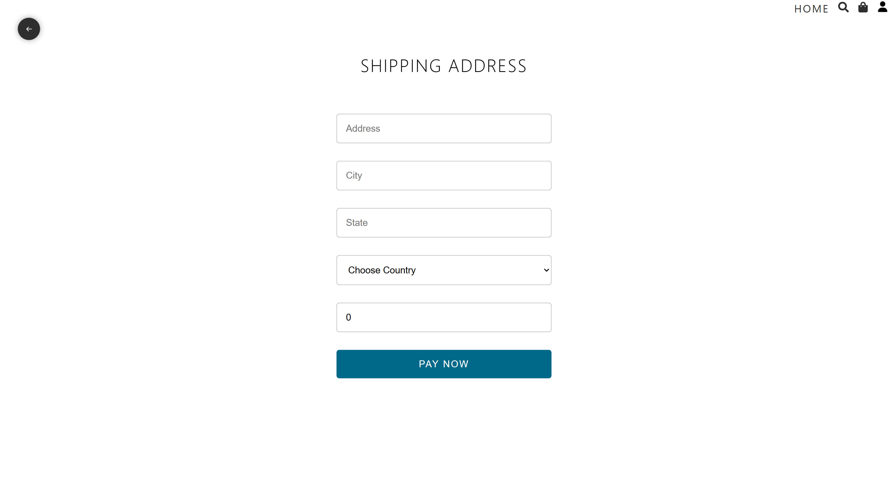

<h3>Payment page</h3>

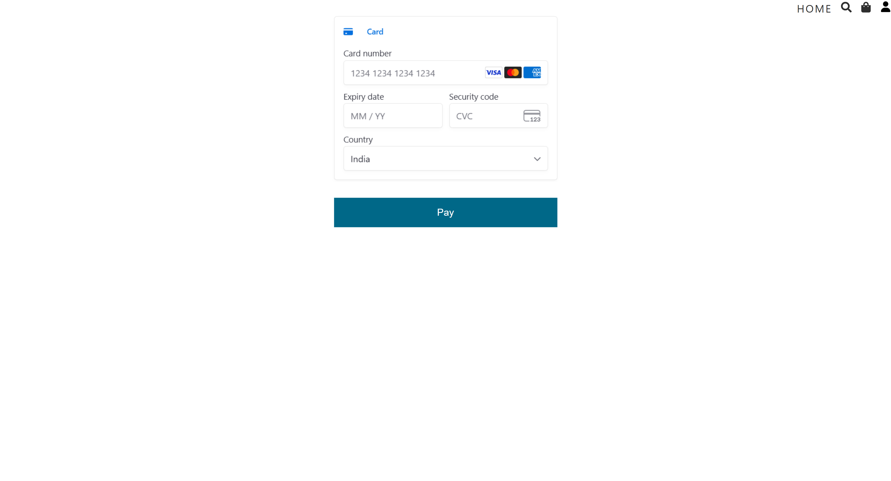

<h3>Admin dashboard</h3>

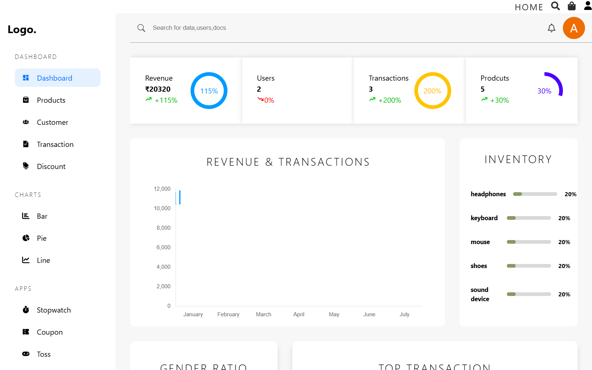

<h3>Admin dashboard - All Transaction page</h3>

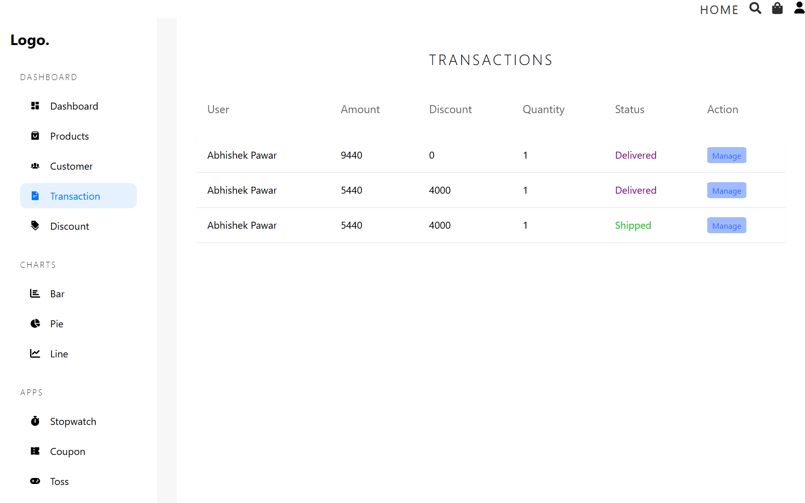

<h3>Admin dashboard - All products page</h3>

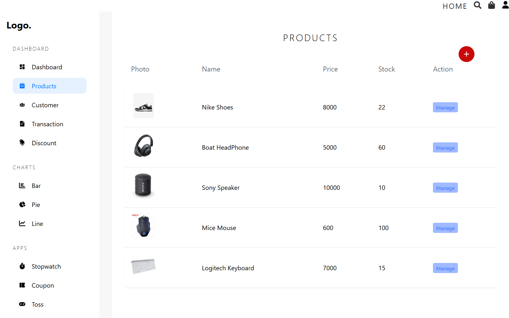

<h3>Admin dashboard - All Discounts page<h3>

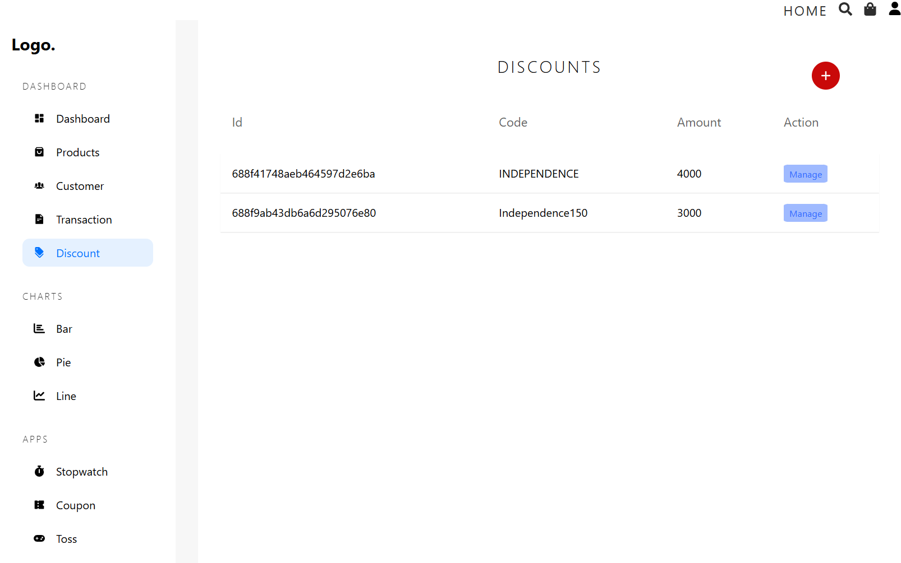

<h3>Admin dashboard - All users page</h3>

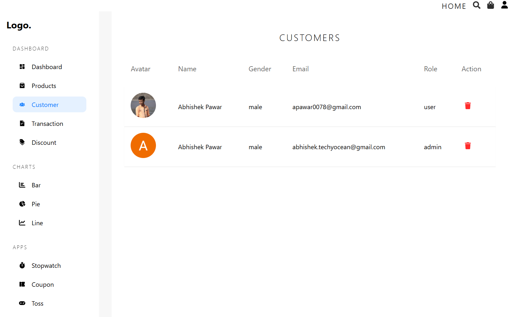

<h2>Code Review </h2>
Your contribution will be reviewed by the project maintainers. Be prepared to address any feedback or suggestions to ensure the quality and compatibility of your changes.

<h2>Thank You!</h2>
Thank you for considering contributing to the eCommerce Platform Project. Your efforts help make this project better for everyone. If you have any questions or need assistance, feel free to reach out through the issue tracker or discussions. Happy coding🤩!
